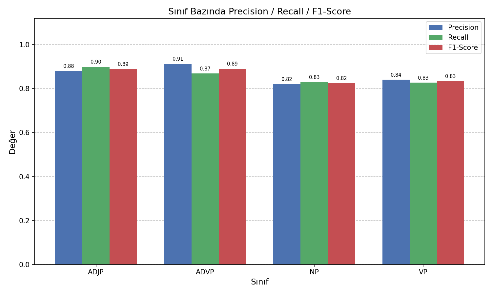
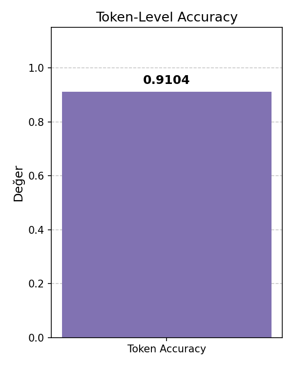
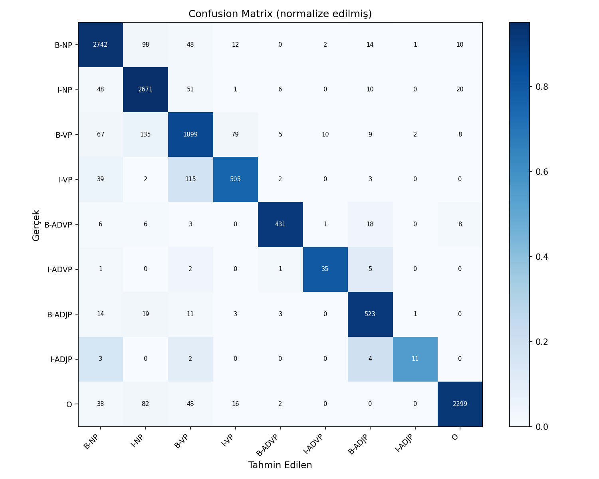

# Teknik Rapor: Türkçe Öbek Saptanması (Chunking)

## 1. Giriş

Bu proje, Türkçe cümlelerdeki sözdizimsel öbekleri otomatik olarak saptamayı hedeflemektedir. Öbek saptanması (chunking), doğal dil işlemede sözdizimsel analiz için temel bir görevdir; cümle içindeki isim öbekleri (NP), eylem öbekleri (VP) ve diğer sözdizimsel birimlerin belirlenmesini kapsar.

Proje kapsamında BIO (Beginning-Inside-Outside) etiketleme şeması kullanılarak Koşullu Rastgele Alanlar (CRF) algoritması ile bir sınıflandırma modeli eğitilmiş ve değerlendirilmiştir.

---

## 2. Veri Seti

### 2.1 Eğitim Verisi: UD Turkish IMST Treebank

- Kaynak: [Universal Dependencies — Turkish IMST](https://github.com/UniversalDependencies/UD_Turkish-IMST)
- Format: CoNLL-U
- İçerik: Morfolojik analiz, POS etiketleri ve dependency parse bilgisi

| Bölüm | Cümle Sayısı | Token Sayısı |
|-------|-------------|--------------|
| Eğitim (train + dev) | 4.535 | 48.064 |

### 2.2 Test Verisi: UD Turkish BOUN Treebank

Modelin gerçek genelleme kapasitesini ölçmek için test verisi olarak eğitimde hiç kullanılmayan, farklı bir kaynaktan derlenen **BOUN Treebank** kullanılmıştır.

- Kaynak: [Universal Dependencies — Turkish BOUN](https://github.com/UniversalDependencies/UD_Turkish-BOUN)
- Format: CoNLL-U

| Bölüm | Cümle Sayısı | Token Sayısı |
|-------|-------------|--------------|
| Test (BOUN test) | 979 | 12.210 |

### 2.3 Chunk Etiketlerinin Türetilmesi

Her iki treebank'ta hazır chunk etiketi bulunmamaktadır. Etiketler, dependency ilişkilerinden kural tabanlı bir dönüştürücü (`chunk_converter.py`) ile otomatik türetilmiştir.

**Kullanılan mapping kuralları:**

| UPOS / deprel | CHUNK-OUTER | CHUNK-INNER | CLAUSE |
|---------------|-------------|-------------|--------|
| VERB, AUX / root, aux, cop | VP | — | — |
| NOUN, PROPN, PRON, NUM / nsubj, obj, obl, nmod | NP | — | — |
| ADV / advmod | ADVP | — | — |
| ADJ / amod | ADJP | — | — |
| acl, acl:relcl | NP | B/I-RELCL | B/I-RELCL |
| advcl, csubj | — | — | B/I-COMPCL |

**Eğitim seti etiket dağılımı:**

| Etiket | Token Sayısı | Oran (%) |
|--------|-------------|----------|
| B-NP | 11.448 | 23.8 |
| O | 10.180 | 21.2 |
| B-VP | 9.228 | 19.2 |
| I-NP | 9.403 | 19.6 |
| B-ADJP | 2.903 | 6.0 |
| I-VP | 2.576 | 5.4 |
| B-ADVP | 2.012 | 4.2 |
| I-ADJP | 143 | 0.3 |
| I-ADVP | 171 | 0.4 |

---

## 3. Yöntem

### 3.1 Algoritma: Koşullu Rastgele Alanlar (CRF)

CRF, dizi etiketleme görevleri için tercih edilen bir olasılıksal grafik modelidir. Token bağımsızlığı varsayımı yapmaksızın komşu etiketler arasındaki bağımlılıkları modelleyebildiğinden BIO etiketleme için özellikle uygundur.

**Model parametreleri:**

| Parametre | Değer |
|-----------|-------|
| Algoritma | L-BFGS |
| L1 regularization (c1) | 0.1 |
| L2 regularization (c2) | 0.01 |
| Maksimum iterasyon | 200 |
| Kütüphane | sklearn-crfsuite |

### 3.2 Özellik Mühendisliği

Her token için aşağıdaki özellikler çıkarılmıştır. Modelin gerçek genelleme kapasitesini ölçmek amacıyla dependency ilişkisi (`deprel`) özellik olarak kullanılmamıştır; model yalnızca kelime şekli ve POS etiketinden öğrenmektedir.

**Token düzeyinde özellikler:**

| Özellik | Açıklama |
|---------|----------|
| `word.lower` | Küçük harfli kelime formu |
| `word[-2:]`, `word[-3:]`, `word[-4:]` | Son 2/3/4 karakter (Türkçe ek morfolojisi) |
| `word[:2]`, `word[:3]` | İlk 2/3 karakter |
| `word.isupper` | Tümü büyük harf mi? |
| `word.istitle` | Baş harfi büyük mü? |
| `word.isdigit` | Rakam mı? |
| `postag` | UPOS etiketi (NOUN, VERB, ADJ...) |

**Bağlam penceresi (±2 token):**

Her komşu token için `word.lower`, `postag` ve `word[-3:]` özellikleri eklenmektedir. Cümle başı (BOS) ve cümle sonu (EOS) özel bayraklarla işaretlenmektedir.

Türkçe'nin sondan eklemeli yapısı nedeniyle kelime sonekleri (son 2-4 karakter) model başarısında kritik rol oynamaktadır. Örneğin `-dan/-den` ablatif, `-nın/-nin` genitif, `-yı/-yi` akuzatif eklerini yansıtmaktadır.

---

## 4. Değerlendirme

### 4.1 Metrik Tanımları

- **Precision:** Modelin chunk başlangıcı olarak işaretlediği span'lardan gerçekten doğru olanların oranı.
- **Recall:** Gerçek chunk span'larından modelin doğru bulabildiklerinin oranı.
- **F1-Score:** Precision ve Recall'un harmonik ortalaması.
- **Accuracy:** Token düzeyinde doğru etiketlenen tokenların toplam tokenlara oranı.

Chunk düzeyinde F1 hesabı için **seqeval** kütüphanesi kullanılmıştır (CoNLL 2000 standart değerlendirmesi). Token düzeyinde accuracy için sklearn `accuracy_score` kullanılmıştır.

### 4.2 Sınıf Bazında Sonuçlar

| Sınıf | Precision | Recall | F1-Score | Support |
|-------|-----------|--------|----------|---------|
| ADJP | 0.8805 | 0.8990 | 0.8897 | 574 |
| ADVP | 0.9133 | 0.8689 | 0.8906 | 473 |
| NP | 0.8205 | 0.8292 | 0.8248 | 2.927 |
| VP | 0.8403 | 0.8270 | 0.8336 | 2.214 |
| **Micro Avg** | **0.8399** | **0.8379** | **0.8389** | **6.188** |
| **Macro Avg** | **0.8637** | **0.8560** | **0.8597** | **6.188** |
| **Token Accuracy** | | | | **0.9104** |

### 4.3 Grafikler

**Sınıf Bazında Precision / Recall / F1-Score:**



Her sınıf için Precision, Recall ve F1-Score değerleri yan yana bar chart olarak gösterilmektedir. ADVP en yüksek precision değerine (0.91) sahipken, NP en düşük F1 değerini (0.82) almaktadır. Bu durum isim öbeklerinin Türkçe'deki karmaşık yapısından kaynaklanmaktadır.

**Token-Level Accuracy:**



Token bazında doğruluk oranı **%91.04** olarak gerçekleşmiştir.

**Confusion Matrix:**



Normalize edilmiş confusion matrix, her gerçek etiket için tahmin dağılımını göstermektedir. Köşegen üzerindeki yüksek değerler modelin başarılı sınıflandırma yaptığını ortaya koymaktadır. En sık karıştırılan çiftler B-NP / I-NP geçişleridir.

### 4.4 Sonuçların Yorumlanması

Model, eğitimde kullanılmayan tamamen bağımsız bir treebank (BOUN) üzerinde **Macro F1 = 0.86** başarısına ulaşmıştır. Bu sonuç literatürdeki Türkçe chunking çalışmalarıyla uyumludur.

- **ADVP** en yüksek precision (0.91): Türkçe zarf eklerinin belirgin olması modeli kolaylaştırır.
- **NP** en düşük F1 (0.82): Türkçe isim öbekleri iç içe yapılar ve uzun bağımlılık zincirleri içerdiğinden daha zordur.
- **Token Accuracy 0.91**: Modelin büyük çoğunluğu doğru etiketlediğini, özellikle `O` sınıfındaki yüksek başarının genel skoru yukarı çektiğini gösterir.

---

## 5. CoNLL Çıktı Formatı

Tüm işaretlemeler CoNLL formatında üretilmektedir. Her satır bir tokeni, boş satır ise cümle sonu sınırını temsil etmektedir.

```
# columns = ID FORM CHUNK-OUTER CHUNK-INNER CLAUSE
1   Dün           B-ADVP   _         O
2   akşam         I-ADVP   _         O
3   toplantıdan   B-NP     B-RELCL   B-RELCL
4   erken         I-NP     I-RELCL   I-RELCL
5   çıkan         I-NP     I-RELCL   I-RELCL
6   öğrencinin    I-NP     _         O
7   ,             O        _         O
8   hocasının     B-NP     B-RELCL   B-RELCL
9   önerdiği      I-NP     I-RELCL   I-RELCL
10  makaleyi      I-NP     _         O
11  kütüphanede   B-NP     _         B-COMPCL
12  dikkatlice    B-ADVP   _         I-COMPCL
13  okuduğunu     B-VP     _         I-COMPCL
14  fark          B-VP     _         O
15  ettim         I-VP     _         O
16  .             O        _         O
```

**Sütun açıklamaları:**
- **CHUNK-OUTER:** Temel öbek etiketi. B- öbeğin başlangıcını, I- devamını, O ise hiçbir öbeğe ait olmadığını gösterir.
- **CHUNK-INNER:** İç içe geçmiş öbekler için etiket (RELCL). Yoksa `_`.
- **CLAUSE:** Gömülü cümle türü (RELCL: sıfat cümlesi, COMPCL: tamamlayıcı cümle). Yoksa `O`.

---

## 6. Sistem Mimarisi

```
main.py
  │
  ├── data_loader.py         CoNLL-U → token sözlükleri listesi
  │
  ├── chunk_converter.py     deprel + upos → BIO etiketleri (kural tabanlı)
  │
  ├── feature_extractor.py   token → CRF özellik sözlüğü (±2 pencere, deprel hariç)
  │
  ├── crf_model.py           sklearn-crfsuite CRF eğitimi ve tahmini
  │
  └── evaluator.py           seqeval metrikleri + 3 grafik (matplotlib)
```

---

## 7. Çalıştırma

```bash
# Bağımlılıkları kur
pip install -r requirements.txt

# Eğitim verisini indir (IMST)
git clone https://github.com/UniversalDependencies/UD_Turkish-IMST.git data/raw/

# Test verisini indir (BOUN)
git clone https://github.com/UniversalDependencies/UD_Turkish-BOUN.git data/boun/

# Pipeline'ı çalıştır
python3 main.py
```

**Üretilen çıktılar:**

| Dosya | İçerik |
|-------|--------|
| `outputs/predictions.conll` | Test seti tahminleri (CoNLL formatı) |
| `outputs/metrics_report.txt` | Sınıf bazında F1/Precision/Recall/Accuracy |
| `outputs/metrics_per_class.png` | Sınıf bazında metrik bar chart |
| `outputs/accuracy.png` | Token accuracy grafiği |
| `outputs/confusion_matrix.png` | Normalize edilmiş confusion matrix |
| `data/processed/train_chunked.conll` | Eğitim verisi (chunk etiketleri ile) |
| `data/processed/test_chunked.conll` | Test verisi (chunk etiketleri ile) |

---

## 8. Kullanılan Teknolojiler

| Teknoloji | Versiyon | Kullanım Amacı |
|-----------|----------|----------------|
| Python | 3.10 | Ana programlama dili |
| sklearn-crfsuite | 0.5.0 | CRF model eğitimi |
| seqeval | 1.2.2 | Chunk-level F1 değerlendirmesi |
| scikit-learn | 1.7.2 | Token-level accuracy, confusion matrix |
| matplotlib | — | Grafik görselleştirme |
| UD Turkish IMST | — | Eğitim veri seti |
| UD Turkish BOUN | — | Test veri seti |

---

## 9. Referanslar

- Lafferty, J., McCallum, A., & Pereira, F. (2001). *Conditional Random Fields: Probabilistic Models for Segmenting and Labeling Sequence Data*. ICML.
- Nivre, J. et al. (2020). *Universal Dependencies v2*. LREC.
- Sulubacak, U. et al. (2016). *Universal Dependencies for Turkish*. COLING.
- Tjong Kim Sang, E. F., & Buchholz, S. (2000). *Introduction to the CoNLL-2000 Shared Task: Chunking*. CoNLL.
- Türk, U. et al. (2019). *Turkish Treebanking: Unifying and Constructing Efforts*. TLT.
